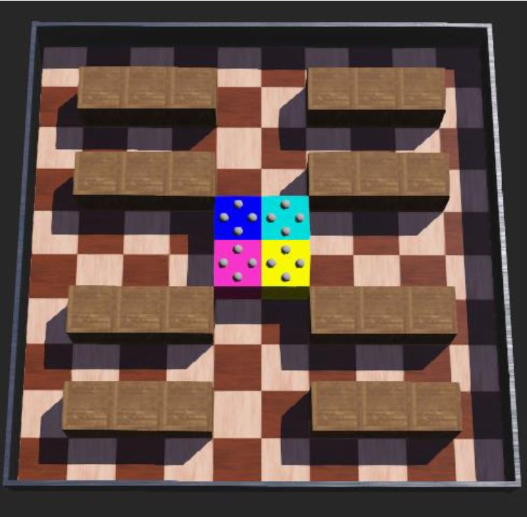

Voor de opdracht van connected systems hebben ik in een groep van vier studenten een vtuele robot gemaakt. Deze robot moest door middel van pathfinding naar een locatie. Deze eindlocatie kan vanaf een centrale server doorgegeven worden. Ook zijn er fysieke noodknoppen aanwezig die de robot stil kan zetten.

