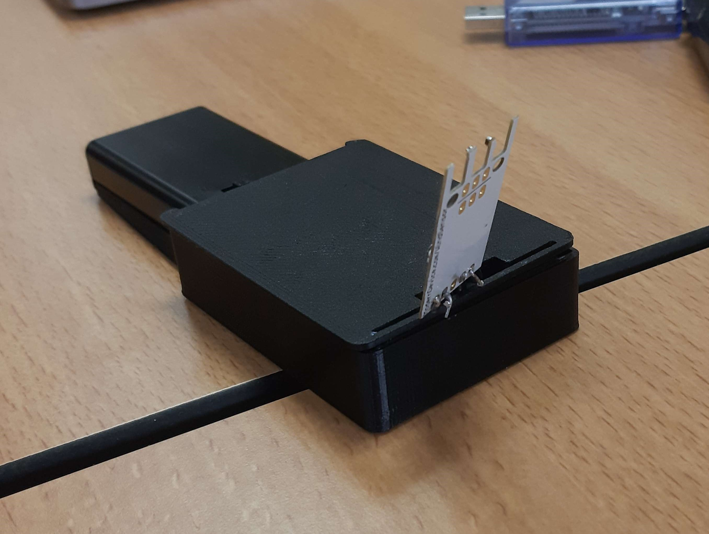
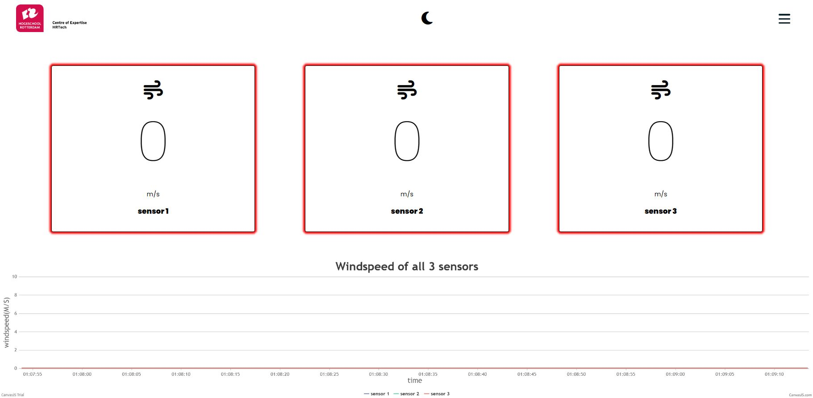

Voor project 7-8 heb ik in groepsverband voor een externe opdrachtgever een modulaire sensormodule gemaakt die de windsnelheid in een windtunnel meet. De sensordata is uiteindelijk ook te zien op een GUI.

