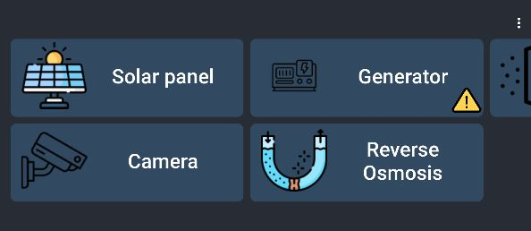
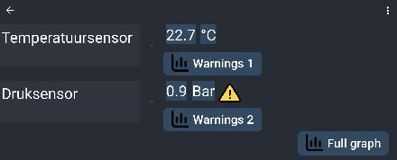
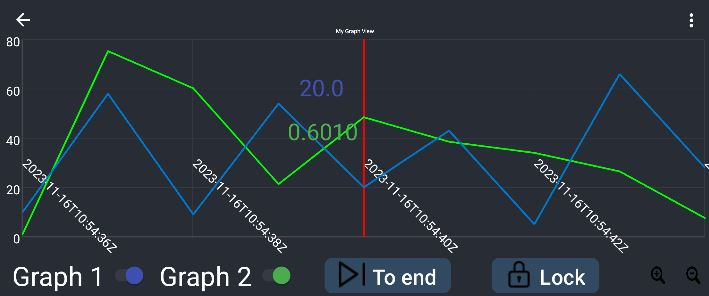
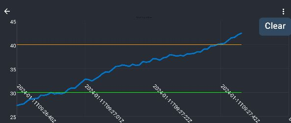

De stageopdracht richte zich op het ontwikkelen van een applicatie voor de monitoring van de waterbarge van OceansX, een drijvend platform dat zoutwater omzet in zoetwater via omgekeerde osmos. 
Deze applicatie werk op een Augmented Reality (AR) bril.

