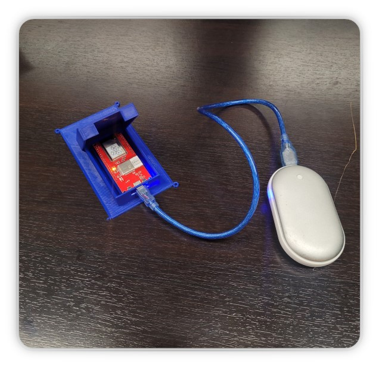
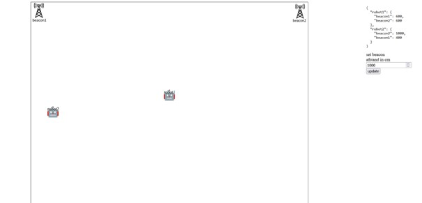

Voor het tinlab embedded systems heb ik met een groep van vier studenten de lokalisatiemodules van een robot ontwikkeld.
Dit is uiteindelijk gedaan met Ultra Wideband (UWB).
De lokatie van de robot is te zien op een GUI.

